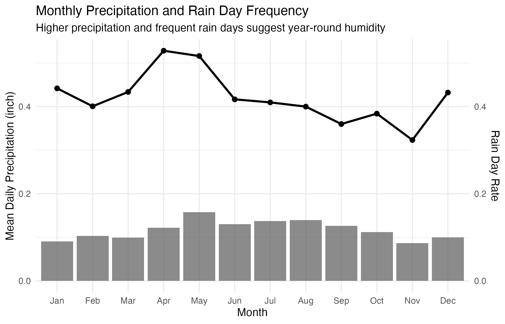
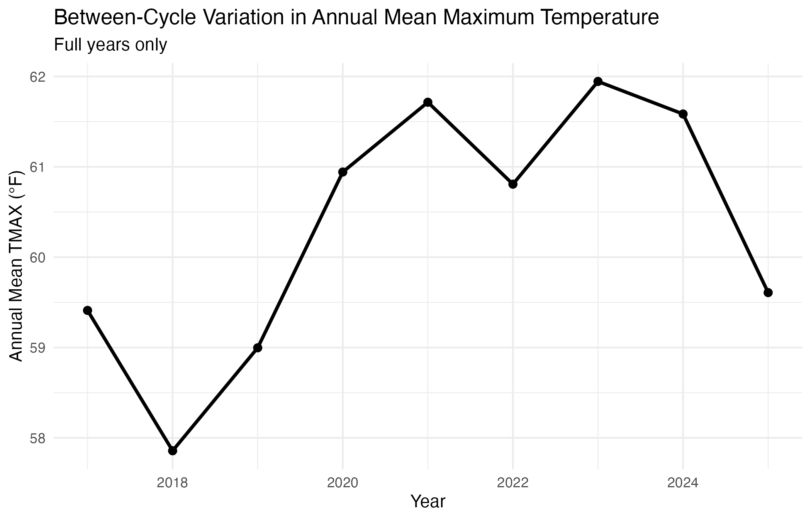
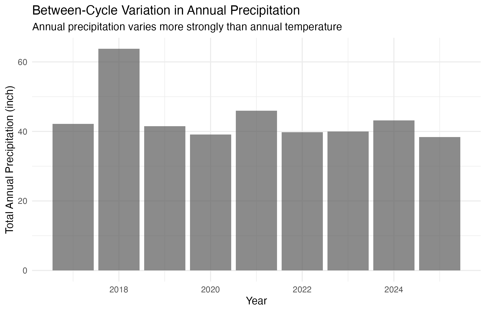
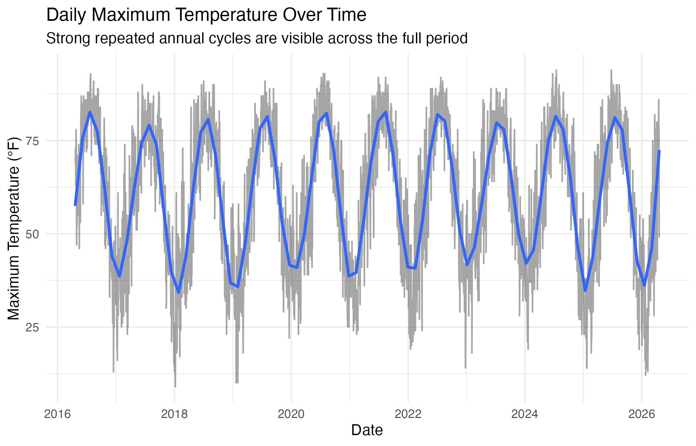

# Introduction

This report explores daily weather patterns in State College, Pennsylvania using daily station-level weather records from NOAA Climate Data Online. The purpose of the analysis is to understand how local weather varies across years, months, and seasons. The project focuses on maximum temperature, minimum temperature, precipitation, snowfall, and snow depth.

The main research question is: **What patterns can we observe in daily weather in State College, Pennsylvania over the last ten years?** More specifically, the analysis examines whether State College shows clear seasonal temperature patterns, which months tend to receive more precipitation, and how snowfall varies across years.

# Data Provenance

The data used in this report come from NOAA Climate Data Online, specifically the Global Historical Climatology Network Daily data for the State College, Pennsylvania weather station. The station used for this project is **STATE COLLEGE, PA US**, station ID **GHCND:USC00368449**. The working file for this analysis is `SC_weather_10.csv`.

The dataset contains daily observations. Important original variables include daily maximum temperature (`TMAX`), daily minimum temperature (`TMIN`), precipitation (`PRCP`), snowfall (`SNOW`), and snow depth (`SNWD`). Additional variables were created during data cleaning, including `year`, `month`, `season`, `temp_range`, `rain_day`, `snow_day`, `heavy_prcp_day`, and `freezing_day`.

Because the data come from NOAA, a public scientific data provider, the dataset is appropriate for reproducible exploratory data analysis. However, the analysis should still be interpreted carefully because 2016 and 2026 are partial years in the current file, rather than complete calendar years.

# FAIR and CARE Principles

The dataset generally satisfies the **FAIR principles**. It is findable because it can be located through NOAA Climate Data Online using the station ID. It is accessible because NOAA provides public access to daily weather station data. It is interoperable because the data are stored in a standard CSV format and use common weather variables. It is reusable because the data include clear variable names, station information, and measurement records that can be analyzed in R.

The **CARE principles** are less directly applicable because this project does not use Indigenous data or community-owned cultural data. However, the project still follows the spirit of responsible data use by clearly describing the source, avoiding unsupported causal claims, and using the data only for exploratory weather analysis. The report also acknowledges NOAA as the original data provider and maintains transparency about created variables and partial-year observations.

# Exploratory Data Analysis

## Annual Weather Summary

@tbl-annual-summary summarizes the annual weather records. Complete years generally contain 365 or 366 days, while 2016 and 2026 are partial years in this file. For that reason, comparisons involving total precipitation or total snowfall should focus mainly on complete years.

| Year | Days observed | Avg. Maximum Temp | Avg. Minimum Temp | Avg. Daily Temp Range | Total Precipitation | Total Snowfall | Max Snow Depth | Rain Days | Snow Days | Freezing Days |
|------:|------:|------:|------:|------:|------:|------:|------:|------:|------:|------:|
| 2016 | 256 | 67.6 | 50.5 | 17.1 | 24.89 | 7.0 | 4 | 102 | 7 | 36 |
| 2017 | 365 | 59.4 | 43.3 | 16.2 | 42.19 | 37.7 | 10 | 161 | 23 | 114 |
| 2018 | 365 | 57.9 | 42.8 | 15.1 | 63.75 | 39.1 | 11 | 184 | 24 | 131 |
| 2019 | 365 | 59.0 | 42.4 | 16.6 | 41.50 | 32.5 | 7 | 155 | 23 | 128 |
| 2020 | 366 | 60.9 | 43.9 | 17.0 | 39.10 | 25.2 | 13 | 151 | 19 | 110 |
| 2021 | 365 | 61.7 | 44.0 | 17.7 | 45.94 | 32.3 | 12 | 157 | 31 | 121 |
| 2022 | 365 | 60.8 | 41.7 | 19.1 | 39.80 | 43.0 | 5 | 147 | 26 | 130 |
| 2023 | 365 | 61.9 | 44.0 | 18.0 | 39.97 | 11.1 | 2 | 154 | 16 | 102 |
| 2024 | 366 | 61.6 | 44.4 | 17.2 | 43.18 | 28.0 | 5 | 144 | 19 | 100 |
| 2025 | 365 | 59.6 | 42.3 | 17.3 | 38.36 | 21.8 | 4 | 142 | 28 | 122 |
| 2026 | 110 | 45.0 | 27.2 | 17.9 | 9.17 | 20.5 | 10 | 40 | 11 | 67 |

: Annual weather summary for State College, PA. {#tbl-annual-summary}

The table shows that annual average maximum temperatures for complete years are mostly near the upper 50s to low 60s in degrees Fahrenheit. The largest annual precipitation total appears in 2018, while 2022 has the largest total snowfall among the complete years shown.

## Annual Temperature Pattern

{#fig-annual-temperature width="85%" fig-alt="Line graph of average daily maximum and minimum temperature by year in State College, PA. Complete years show relatively stable average temperatures, while the partial year 2026 is lower because only part of the year is included."}

@fig-annual-temperature shows that the annual temperature pattern is relatively stable for complete years. Average maximum temperature usually remains close to 60°F, while average minimum temperature is generally in the low to mid 40s. The sharp drop in 2026 should not be interpreted as a long-term cooling pattern because 2026 is only a partial year in the dataset.

## Monthly Weather Summary

@tbl-monthly-summary compares monthly averages and totals across the full dataset. This table helps show the seasonal structure of weather in State College.

| Month | Avg. Maximum Temp | Avg. Minimum Temp | Median Daily Precipitation | Total Precipitation | Total Snowfall | Rain Days | Snow Days |
|:--------|--------:|--------:|--------:|--------:|--------:|--------:|--------:|
| January | 35.4 | 22.1 | 0.00 | 28.07 | 88.9 | 137 | 65 |
| February | 40.5 | 24.0 | 0.00 | 29.08 | 76.4 | 113 | 58 |
| March | 49.0 | 30.3 | 0.00 | 30.71 | 44.3 | 134 | 33 |
| April | 60.5 | 41.1 | 0.01 | 36.72 | 9.6 | 159 | 6 |
| May | 69.1 | 51.2 | 0.01 | 48.86 | 0.0 | 160 | 0 |
| June | 77.7 | 59.7 | 0.00 | 38.98 | 0.0 | 125 | 0 |
| July | 83.3 | 65.3 | 0.00 | 42.65 | 0.0 | 127 | 0 |
| August | 80.6 | 63.0 | 0.00 | 43.21 | 0.0 | 124 | 0 |
| September | 74.3 | 55.9 | 0.00 | 37.83 | 0.0 | 108 | 0 |
| October | 63.6 | 45.1 | 0.00 | 34.70 | 0.0 | 119 | 0 |
| November | 49.8 | 33.2 | 0.00 | 26.01 | 21.9 | 97 | 18 |
| December | 39.5 | 26.5 | 0.00 | 31.03 | 57.1 | 134 | 47 |

: Monthly weather summary for State College, PA. {#tbl-monthly-summary}

The monthly table shows a clear seasonal temperature cycle. July has the highest average maximum temperature, while January has the lowest average maximum and minimum temperatures. Snowfall is concentrated in winter and early spring months, especially January, February, March, and December.

## Monthly Precipitation

{#fig-monthly-precipitation width="85%" fig-alt="Bar chart of total precipitation by month in State College, PA. May has the highest precipitation total, and precipitation is present across all months."}

@fig-monthly-precipitation shows that precipitation is not limited to one season. May has the highest total precipitation in the summarized dataset, while late fall and winter months tend to be lower than spring and summer months. This supports the idea that rainfall and precipitation in State College occur throughout the year but vary by month.

## Distribution of Daily Precipitation

{#fig-precip-distribution width="85%" fig-alt="Histogram of daily precipitation in State College, PA. Most days have little or no precipitation, while a small number of days have much larger precipitation totals."}

@fig-precip-distribution shows that daily precipitation is strongly right-skewed. Most days have little or no precipitation, while a small number of days have much larger precipitation values. This explains why the median daily precipitation in many months is 0.00 even though the monthly total precipitation is not zero.

## Seasonal Temperature Distribution

{#fig-seasonal-temp width="85%" fig-alt="Boxplots of daily maximum temperature by season in State College, PA. Summer has the highest daily maximum temperatures, winter has the lowest, and spring and fall show wider transitional variation."}

@fig-seasonal-temp shows that daily maximum temperatures differ strongly by season. Summer has the highest median daily maximum temperature, while winter has the lowest. Spring and fall show broader variation because they are transition seasons.

## Annual Snowfall

{#fig-annual-snowfall width="85%" fig-alt="Bar chart of total snowfall by year in State College, PA. Annual snowfall varies substantially, with 2022 high and 2023 low among complete years."}

@fig-annual-snowfall shows that snowfall varies substantially from year to year. Among the complete years, 2022 has the highest total snowfall, while 2023 has a much lower snowfall total. This suggests that winter weather in State College can vary considerably even when annual average temperatures are relatively stable.

## Monthly Temperature Distribution

{#fig-monthly-temp-boxplot width="85%" fig-alt="Boxplots of daily maximum temperature by month in State College, PA, with a line showing the monthly median trend."}

@fig-monthly-temp-boxplot shows that daily maximum temperatures follow a strong seasonal pattern. Temperatures are lowest in January and February, rise through spring, peak in July, and then decline through fall and early winter. The boxplots also show that temperature variation differs by month. Transitional months such as March, April, October, and November show wider ranges because they include both colder and warmer days. The median trend line makes the annual temperature cycle easier to see while the boxplots preserve the daily-level variation within each month.

## Rainfall and Temperature Diagram

{#fig-rainfall-temperature width="85%" fig-alt="Rainfall and temperature diagram showing average monthly precipitation bars and average monthly temperature line for State College, PA."}

@fig-rainfall-temperature shows that State College has both a clear annual temperature cycle and year-round precipitation. Average temperature increases from winter to summer, reaches its highest level in July, and then decreases during fall and winter. Precipitation occurs in every month, with relatively higher values in late spring and summer. This pattern suggests rain-heat synchronization because warmer months also receive substantial precipitation. Overall, the diagram supports the interpretation that State College has a humid climate pattern with warm to hot summers, cold winters, and no obvious dry season.

## Time Series Analysis

### Monthly Within-Cycle Variation Summary

| Month | Mean TMAX | SD TMAX | Mean TMIN | SD TMIN | Mean PRCP | Rain Day Rate | Freezing Day Rate |
|---------|--------:|--------:|--------:|--------:|--------:|--------:|--------:|
| Jan | 35.4 | 10.7 | 22.1 | 11.2 | 0.091 | 44.2% | 83.2% |
| Feb | 40.5 | 11.8 | 24.0 | 9.23 | 0.103 | 40.1% | 83.7% |
| Mar | 49.0 | 12.1 | 30.3 | 8.90 | 0.099 | 43.4% | 61.3% |
| Apr | 60.5 | 12.2 | 41.1 | 8.74 | 0.122 | 52.8% | 20.6% |
| May | 69.1 | 10.4 | 51.2 | 8.06 | 0.158 | 51.6% | 0.6% |
| Jun | 77.6 | 7.15 | 59.7 | 6.41 | 0.130 | 41.7% | 0.0% |
| Jul | 83.3 | 4.91 | 65.3 | 4.74 | 0.138 | 41.0% | 0.0% |
| Aug | 80.6 | 5.80 | 63.0 | 5.39 | 0.139 | 40.0% | 0.0% |
| Sep | 74.3 | 7.24 | 55.9 | 7.01 | 0.126 | 36.0% | 0.0% |
| Oct | 63.6 | 9.50 | 45.1 | 8.60 | 0.112 | 38.4% | 3.9% |
| Nov | 49.8 | 11.0 | 33.2 | 7.42 | 0.087 | 32.3% | 52.3% |
| Dec | 39.5 | 9.50 | 26.5 | 8.29 | 0.100 | 43.2% | 78.7% |

: Monthly summary of within-cycle variation in temperature, precipitation, rain frequency, and freezing conditions.

The monthly summary shows a strong seasonal cycle in temperature. Maximum temperature increases steadily from winter to summer, peaking in July at 83.3°F, before declining again toward winter. Summer also has the smallest standard deviation, while spring and fall show wider variation. Precipitation remains present throughout the year, with the highest mean daily precipitation in May. Rain day frequency remains relatively high across all months, supporting the interpretation of a humid climate without a clear dry season.

### Within-Cycle Variation in Maximum Temperature

{#fig-within-cycle-temp width="85%" fig-alt="Line chart of monthly mean maximum temperature in State College, PA, with a standard deviation band. Temperatures are lowest in winter, highest in July, and more variable during spring and fall."}

@fig-within-cycle-temp shows a clear annual temperature cycle. Mean maximum temperature rises from about 35°F in January to about 83°F in July, then declines again toward winter. The shaded standard deviation band shows that spring and fall have broader variation, while summer is relatively more stable. This indicates strong within-cycle variation driven by seasonal temperature change.

### Monthly Precipitation and Rain Day Frequency

{#fig-monthly-prcp-rain width="85%" fig-alt="Bar and line chart of mean daily precipitation and rain day rate by month in State College, PA. Rainfall is present throughout the year, with higher precipitation in late spring and summer."}

@fig-monthly-prcp-rain shows that precipitation is distributed across the full year rather than concentrated in a single wet season. Mean daily precipitation is highest around May and remains relatively high through summer. Rain day frequency also stays substantial in every month, which supports the interpretation of a humid climate with no clear dry season. The overlap between warmer months and higher precipitation also suggests rain-heat synchrony.

### Annual Between-Cycle Variation Summary

| Year | Mean TMAX | Mean TMIN | SD TMAX | Total PRCP | Total Snow | Rain Days | Snow Days | Freezing Days |
|--------|-------:|-------:|-------:|-------:|-------:|-------:|-------:|-------:|
| 2017 | 59.4 | 43.3 | 18.7 | 42.2 | 37.7 | 161 | 23 | 114 |
| 2018 | 57.9 | 42.8 | 20.3 | 63.8 | 39.1 | 184 | 24 | 131 |
| 2019 | 59.0 | 42.4 | 19.4 | 41.5 | 32.5 | 155 | 23 | 128 |
| 2020 | 60.9 | 43.9 | 18.4 | 39.1 | 25.2 | 151 | 19 | 110 |
| 2021 | 61.7 | 44.0 | 18.7 | 45.9 | 32.3 | 157 | 31 | 121 |
| 2022 | 60.8 | 41.7 | 19.4 | 39.8 | 43.0 | 147 | 26 | 130 |
| 2023 | 61.9 | 44.0 | 16.2 | 40.0 | 11.1 | 154 | 16 | 102 |
| 2024 | 61.6 | 44.4 | 18.0 | 43.2 | 28.0 | 144 | 19 | 100 |
| 2025 | 59.6 | 42.3 | 19.8 | 38.4 | 21.8 | 142 | 28 | 122 |

: Annual summary of between-cycle variation across complete years only.

The annual summary shows that mean temperature remains relatively stable across years, with most annual mean maximum temperatures staying between 58°F and 62°F. In contrast, total precipitation and snowfall vary much more substantially. For example, 2018 is the wettest year, while 2023 has much lower snowfall. This suggests that temperature is more stable over time, while precipitation and snowfall are more sensitive to year-to-year weather variability.

### Between-Cycle Variation in Annual Mean Maximum Temperature

{#fig-annual-mean-temp width="85%" fig-alt="Line chart of annual mean maximum temperature in State College, PA, using complete years only. Annual mean maximum temperature remains relatively stable across years."}

@fig-annual-mean-temp shows that annual mean maximum temperature varies only moderately across complete years. Most values remain within a narrow range of roughly 58°F to 62°F. Compared with the much larger monthly temperature range, this suggests that between-cycle temperature variation is weaker than within-cycle seasonal variation. In other words, the annual cycle is much stronger than year-to-year temperature fluctuation.

### Between-Cycle Variation in Annual Precipitation

{#fig-annual-prcp width="85%" fig-alt="Bar chart of total annual precipitation in State College, PA, using complete years only. Annual precipitation varies substantially across years, with 2018 especially high."}

@fig-annual-prcp shows that annual precipitation has much stronger between-cycle variation than annual mean temperature. The wettest year is 2018, with total precipitation above 60 inches, while several other complete years are closer to 40 inches. This suggests that precipitation is more irregular across years than temperature, which is expected because rainfall is more strongly affected by storm systems and short-term atmospheric conditions.

### Daily Time Series of Maximum Temperature

{#fig-daily-timeseries-temp width="85%" fig-alt="Daily time series of maximum temperature in State College, PA. The series shows repeated annual cycles with strong short-term daily variation."}

@fig-daily-timeseries-temp shows both short-term daily fluctuation and repeated annual cycles. The gray line captures day-to-day weather variability, while the smoothed line shows the broader seasonal pattern. The repeated peaks and troughs across years indicate strong seasonality, with high summer temperatures and low winter temperatures recurring consistently over time. This confirms that the main structure of the temperature series is annual periodicity.

### Summary Table for Within-Cycle and Between-Cycle Variation

| Dimension                             | Measure                 |  Value |
|---------------------------------------|-------------------------|-------:|
| Within-cycle temperature variation    | Monthly mean TMAX range |   47.9 |
| Within-cycle precipitation variation  | Monthly mean PRCP range | 0.0709 |
| Between-cycle temperature variation   | Annual mean TMAX range  |   4.09 |
| Between-cycle precipitation variation | Annual total PRCP range |   25.4 |

: Summary comparison of within-cycle and between-cycle variation.

The summary table confirms that temperature is dominated by strong within-cycle seasonal variation, while precipitation shows stronger between-cycle irregularity. Monthly mean maximum temperature changes by nearly 48°F within a year, but annual mean maximum temperature changes by only about 4°F across years. In contrast, annual total precipitation varies substantially between years. This indicates that temperature follows a stable annual cycle, while precipitation is more sensitive to interannual variation.

# Overall Data Story

The exploratory analysis shows that State College has a strong seasonal weather pattern and a typical humid continental climate structure. Temperatures are lowest in winter, rise through spring, peak in summer, and decline through fall. Both the seasonal boxplots and the monthly temperature distribution confirm that summer has the highest daily maximum temperatures, while winter has the lowest. Spring and fall show broader variation because they are transition seasons between cold and warm conditions.

The time series analysis further confirms that temperature is dominated by strong within-cycle seasonal variation. Monthly mean maximum temperature increases from about 35°F in January to more than 83°F in July before declining again toward winter, creating a clear annual cycle. The standard deviation bands show that summer temperatures are relatively stable, while spring and fall have wider variation due to rapid seasonal transitions. Daily temperature series across the full period also show repeated annual peaks and troughs, indicating that annual periodicity is the main structure of the temperature pattern.

Precipitation occurs throughout the year rather than being concentrated in a single season. The monthly precipitation totals and the rainfall–temperature diagram show that late spring and summer months contribute more precipitation, while winter precipitation remains lower but is often associated with snowfall. This indicates a pattern of rain–heat synchronization, where warmer months tend to receive relatively more rainfall. Rain day frequency also remains relatively high across all months, which supports the classification of a fully humid climate without a clear dry season.

Snowfall is concentrated mainly in winter and early spring, especially from December through March, but the total annual snowfall varies substantially across years. Some years, such as 2022, show much heavier snowfall than others, while annual average temperatures remain relatively stable. This suggests that winter severity can change considerably even without large shifts in annual mean temperature.

The time series comparison between within-cycle and between-cycle variation shows that seasonal temperature change is much stronger than year-to-year temperature fluctuation. Monthly mean maximum temperature varies by nearly 48°F within a year, while annual mean maximum temperature across complete years varies by only about 4°F. In contrast, annual total precipitation varies much more strongly across years, with 2018 standing out as an especially wet year. This suggests that temperature follows a stable long-term seasonal cycle, while precipitation is more sensitive to interannual atmospheric variability.

The analysis also highlights the importance of distinguishing daily distributions from monthly or annual totals. For example, daily precipitation is strongly right-skewed, meaning that most days have little or no precipitation, while a smaller number of heavy precipitation events contribute substantially to monthly totals. Similarly, monthly boxplots show that average seasonal trends can hide substantial day-to-day variation within each month.

The partial-year observations for 2016 and 2026 are important context. These years should not be compared directly with complete years when interpreting total precipitation, total snowfall, or annual average temperature.

# Open Science and Reproducibility

This project follows open science principles by using a public data source, documenting the data provenance, keeping analysis code in a reproducible R workflow, and reporting created variables clearly. The final project repository should include the raw CSV file, the QMD report, generated figures, citation files, and any scripts used to clean and analyze the data.

The project also applies PCIP by making the report readable for a broad audience, using clear captions and alt text, and avoiding unsupported claims. The analysis is exploratory rather than causal, so the report focuses on describing patterns rather than claiming that one weather pattern causes another.

# Author Contributions

-   **Ata:** Contributed to project planning, data interpretation, and review of weather summaries.
-   **Jincheng:** Contributed to table review, figure interpretation, and report organization.
-   **Qihaohan:** Primary author for the R data cleaning and analysis workflow; contributed to figure generation and report writing.

# Code Appendix

The following code was used to read, clean, summarize, and visualize the data. Code is placed in the appendix so that the main body of the report focuses on interpretation.

```{r}
# Style Guide: tidyverse style guide
# Code Header:
# Primary author: Qihaohan
# Reviewer: Ata / Jincheng

library(tidyverse)
library(lubridate)
library(knitr)
library(scales)
```

```{r}
# Code Header:
# Primary author: Ata
# Reviewer: Qihaohan / Jincheng

weather_raw <- read_csv("SC_weather_10.csv", show_col_types = FALSE)
```

```{r}
# Code Header:
# Primary author: Qihaohan
# Reviewer: Ata / Jincheng

weather_clean <- weather_raw |>
  rename_with(tolower) |>
  mutate(
    date = as_date(date),
    year = year(date),
    month_num = month(date),
    month = factor(
      month_num,
      levels = 1:12,
      labels = c(
        "Jan", "Feb", "Mar", "Apr", "May", "Jun",
        "Jul", "Aug", "Sep", "Oct", "Nov", "Dec"
      )
    ),
    season = case_when(
      month_num %in% c(12, 1, 2) ~ "Winter",
      month_num %in% c(3, 4, 5) ~ "Spring",
      month_num %in% c(6, 7, 8) ~ "Summer",
      month_num %in% c(9, 10, 11) ~ "Fall",
      TRUE ~ NA_character_
    ),
    season = factor(
      season,
      levels = c("Winter", "Spring", "Summer", "Fall")
    ),
    temp_range = tmax - tmin,
    rain_day = prcp > 0,
    snow_day = snow > 0,
    heavy_prcp_day = prcp >= 1,
    freezing_day = tmin <= 32
  )
```

```{r}
# Code Header:
# Primary author: Qihaohan
# Reviewer: Ata / Jincheng

annual_summary <- weather_clean |>
  group_by(year) |>
  summarize(
    days_observed = n(),
    avg_maximum_temp = mean(tmax, na.rm = TRUE),
    avg_minimum_temp = mean(tmin, na.rm = TRUE),
    avg_daily_temp_range = mean(temp_range, na.rm = TRUE),
    total_precipitation = sum(prcp, na.rm = TRUE),
    total_snowfall = sum(snow, na.rm = TRUE),
    max_snow_depth = max(snwd, na.rm = TRUE),
    rain_days = sum(rain_day, na.rm = TRUE),
    snow_days = sum(snow_day, na.rm = TRUE),
    freezing_days = sum(freezing_day, na.rm = TRUE),
    .groups = "drop"
  )
```

```{r}
# Code Header:
# Primary author: Ata
# Reviewer: Qihaohan / Jincheng

monthly_summary <- weather_clean |>
  group_by(month) |>
  summarize(
    avg_maximum_temp = mean(tmax, na.rm = TRUE),
    avg_minimum_temp = mean(tmin, na.rm = TRUE),
    median_daily_precipitation = median(prcp, na.rm = TRUE),
    total_precipitation = sum(prcp, na.rm = TRUE),
    total_snowfall = sum(snow, na.rm = TRUE),
    rain_days = sum(rain_day, na.rm = TRUE),
    snow_days = sum(snow_day, na.rm = TRUE),
    .groups = "drop"
  )
monthly_precipitation_plot <- ggplot(monthly_summary, aes(x = month, y = total_precipitation)) +
  geom_col() +
  labs(
    title = "Total Precipitation by Month in State College, PA",
    subtitle = "Monthly totals aggregated across the ten-year dataset",
    x = "Month",
    y = "Total precipitation",
    caption = "Data source: NOAA Climate Data Online, GHCND:USC00368449"
  ) +
  theme_minimal()

ggsave(
  filename = "figures/monthly_precipitation.png",
  plot = monthly_precipitation_plot,
  width = 7,
  height = 4.5,
  dpi = 300
)
```

```{r}
# Code Header:
# Primary author: Jincheng
# Reviewer: Ata / Qihaohan

annual_temperature_plot <- ggplot(annual_summary, aes(x = year)) +
  geom_line(aes(y = avg_maximum_temp, linetype = "Average maximum"), linewidth = 1) +
  geom_point(aes(y = avg_maximum_temp, shape = "Average maximum"), size = 2) +
  geom_line(aes(y = avg_minimum_temp, linetype = "Average minimum"), linewidth = 1) +
  geom_point(aes(y = avg_minimum_temp, shape = "Average minimum"), size = 2) +
  labs(
    title = "Average Daily Temperature by Year in State College, PA",
    subtitle = "NOAA daily weather station data",
    x = "Year",
    y = "Temperature (°F)",
    linetype = "Measure",
    shape = "Measure",
    caption = "Data source: NOAA Climate Data Online, GHCND:USC00368449"
  ) +
  theme_minimal()
```

```{r}
# Code Header:
# Primary author: Jincheng
# Reviewer: Ata / Qihaohan

monthly_precipitation_plot <- ggplot(monthly_summary, aes(x = month, y = total_precipitation)) +
  geom_col() +
  labs(
    title = "Total Precipitation by Month in State College, PA",
    subtitle = "Monthly totals aggregated across the ten-year dataset",
    x = "Month",
    y = "Total precipitation",
    caption = "Data source: NOAA Climate Data Online, GHCND:USC00368449"
  ) +
  theme_minimal()
```

```{r}
# Code Header:
# Primary author: Qihaohan
# Reviewer: Ata / Jincheng

seasonal_temperature_plot <- ggplot(weather_clean, aes(x = season, y = tmax)) +
  geom_boxplot() +
  labs(
    title = "Distribution of Daily Maximum Temperature by Season",
    subtitle = "Boxplots show seasonal differences in daily high temperatures",
    x = "Season",
    y = "Daily maximum temperature (°F)",
    caption = "Data source: NOAA Climate Data Online, GHCND:USC00368449"
  ) +
  theme_minimal()
```

```{r}
# Code Header:
# Primary author: Qihaohan
# Reviewer: Ata / Jincheng

precipitation_distribution_plot <- ggplot(weather_clean, aes(x = prcp)) +
  geom_histogram(bins = 35) +
  labs(
    title = "Distribution of Daily Precipitation",
    subtitle = "Most days have little or no measured precipitation",
    x = "Daily precipitation",
    y = "Number of days",
    caption = "Data source: NOAA Climate Data Online, GHCND:USC00368449"
  ) +
  theme_minimal()
```

```{r}
# Code Header:
# Primary author: Qihaohan
# Reviewer: Ata / Jincheng

annual_snowfall_plot <- ggplot(annual_summary, aes(x = factor(year), y = total_snowfall)) +
  geom_col() +
  labs(
    title = "Total Snowfall by Year in State College, PA",
    subtitle = "Annual snowfall totals from daily NOAA records",
    x = "Year",
    y = "Total snowfall",
    caption = "Data source: NOAA Climate Data Online, GHCND:USC00368449"
  ) +
  theme_minimal()
```

```{r}
# Integrate boxplot with time series line representation----
# Code Header:
# Primary author: Jincheng
# Reviewer: Ata / Qihaohan

weather_clean$month <- factor(
  weather_clean$month,
  levels = c(
    "Jan", "Feb", "Mar", "Apr", "May", "Jun",
    "Jul", "Aug", "Sep", "Oct", "Nov", "Dec"
  )
)

fig_monthly_temp_improved <- ggplot(weather_clean, aes(x = month, y = tmax)) +
  geom_boxplot(alpha = 0.6) +
  stat_summary(
    aes(group = 1),
    fun = median,
    geom = "line",
    linewidth = 1
  ) +
  stat_summary(
    fun = median,
    geom = "point",
    size = 2
  ) +
  labs(
    title = "Monthly Distribution of Maximum Temperature",
    x = "Month",
    y = "Daily Maximum Temperature (°F)"
  ) +
  theme_minimal()
```

```{r}
# Temperature-percipitation Plot---
# Code Header:
# Primary author: Jincheng
# Reviewer: Ata / Qihaohan

monthly_climate <- weather_clean %>%
  group_by(month_num, month) %>%
  summarise(
    avg_tmax = mean(tmax, na.rm = TRUE),
    avg_tmin = mean(tmin, na.rm = TRUE),
    avg_temp = mean((tmax + tmin) / 2, na.rm = TRUE),
    avg_monthly_prcp = sum(prcp, na.rm = TRUE) / n_distinct(year),
    avg_monthly_snow = sum(snow, na.rm = TRUE) / n_distinct(year),
    avg_rain_days = sum(rain_day, na.rm = TRUE) / n_distinct(year),
    avg_snow_days = sum(snow_day, na.rm = TRUE) / n_distinct(year),
    .groups = "drop"
  ) %>%
  arrange(month_num)

scale_factor <- max(monthly_climate$avg_temp, na.rm = TRUE) /
  max(monthly_climate$avg_monthly_prcp, na.rm = TRUE)

fig_monthly_temp_pcp <- ggplot(monthly_climate, aes(x = month_num)) +
  geom_col(
    aes(y = avg_monthly_prcp * scale_factor),
    alpha = 0.45,
    width = 0.65
  ) +
  geom_line(
    aes(y = avg_temp),
    linewidth = 1
  ) +
  geom_point(
    aes(y = avg_temp),
    size = 2
  ) +
  scale_x_continuous(
    breaks = 1:12,
    labels = monthly_climate$month
  ) +
  scale_y_continuous(
    name = "Average Temperature (°F)",
    sec.axis = sec_axis(
      ~ . / scale_factor,
      name = "Average Monthly Precipitation (inches)"
    )
  ) +
  labs(
    title = "Rainfall and Temperature Diagram for State College, PA",
    x = "Month"
  ) +
  theme_minimal()
```

```{r}
# Time series analysis
# Code Header:
# Primary author: Jincheng
# Reviewer: Ata / Qihaohan

library(tidyverse)
library(lubridate)
library(scales)

weather <- weather_clean |>
  mutate(
    date = as.Date(date),
    year = year(date),
    month_num = month(date),
    month = factor(month.abb[month_num], levels = month.abb),
    rain_day = prcp > 0,
    snow_day = snow > 0,
    freezing_day = tmin <= 32
  )

## Monthly Within-Cycle Variation Summary

monthly_variation <- weather |>
  group_by(month_num, month) |>
  summarise(
    mean_tmax = mean(tmax, na.rm = TRUE),
    sd_tmax = sd(tmax, na.rm = TRUE),
    mean_tmin = mean(tmin, na.rm = TRUE),
    sd_tmin = sd(tmin, na.rm = TRUE),
    mean_prcp = mean(prcp, na.rm = TRUE),
    sd_prcp = sd(prcp, na.rm = TRUE),
    rain_day_rate = mean(rain_day, na.rm = TRUE),
    freezing_day_rate = mean(freezing_day, na.rm = TRUE),
    .groups = "drop"
  )

monthly_variation

## Plot Monthly Maximum Temperature with Seasonal Variation

fig_within_cycle_var_max_temp <- ggplot(monthly_variation, aes(x = month, y = mean_tmax, group = 1)) +
  geom_ribbon(
    aes(
      ymin = mean_tmax - sd_tmax,
      ymax = mean_tmax + sd_tmax,
      group = 1
    ),
    alpha = 0.2
  ) +
  geom_line(linewidth = 1) +
  geom_point(size = 2) +
  labs(
    title = "Within-Cycle Variation in Maximum Temperature",
    subtitle = "Monthly mean TMAX with ±1 standard deviation",
    x = "Month",
    y = "Maximum Temperature (°F)"
  ) +
  theme_minimal()

## Plot Monthly Precipitation and Rain Day Frequency

fig_monthly_prcp_rain_frequency <- ggplot(monthly_variation, aes(x = month, y = mean_prcp, group = 1)) +
  geom_col(alpha = 0.7) +
  geom_line(aes(y = rain_day_rate), linewidth = 1) +
  geom_point(aes(y = rain_day_rate), size = 2) +
  scale_y_continuous(
    name = "Mean Daily Precipitation (inch)",
    sec.axis = sec_axis(~ ., name = "Rain Day Rate")
  ) +
  labs(
    title = "Monthly Precipitation and Rain Day Frequency",
    subtitle = "Higher precipitation and frequent rain days suggest year-round humidity",
    x = "Month"
  ) +
  theme_minimal()

## Annual Between-Cycle Variation Summary

annual_variation <- weather |>
  group_by(year) |>
  summarise(
    mean_tmax = mean(tmax, na.rm = TRUE),
    mean_tmin = mean(tmin, na.rm = TRUE),
    sd_tmax = sd(tmax, na.rm = TRUE),
    total_prcp = sum(prcp, na.rm = TRUE),
    total_snow = sum(snow, na.rm = TRUE),
    rain_days = sum(rain_day, na.rm = TRUE),
    snow_days = sum(snow_day, na.rm = TRUE),
    freezing_days = sum(freezing_day, na.rm = TRUE),
    n_days = n(),
    .groups = "drop"
  ) |>
  filter(n_days >= 300)

annual_variation

## Plot Annual Mean Maximum Temperature Across Years

fig_annual_mean_max_temp_across_years  <- ggplot(annual_variation, aes(x = year, y = mean_tmax)) +
  geom_line(linewidth = 1) +
  geom_point(size = 2) +
  labs(
    title = "Between-Cycle Variation in Annual Mean Maximum Temperature",
    subtitle = "Full years only",
    x = "Year",
    y = "Annual Mean TMAX (°F)"
  ) +
  theme_minimal()

## Plot Annual Total Precipitation Across Years

fig_annual_total_prcp_across_years <- ggplot(annual_variation, aes(x = year, y = total_prcp)) +
  geom_col(alpha = 0.7) +
  labs(
    title = "Between-Cycle Variation in Annual Precipitation",
    subtitle = "Annual precipitation varies more strongly than annual temperature",
    x = "Year",
    y = "Total Annual Precipitation (inch)"
  ) +
  theme_minimal()

## Daily Time Series of Maximum Temperature

fig_daily_timeseries_max_temp <- ggplot(weather, aes(x = date, y = tmax)) +
  geom_line(alpha = 0.35) +
  geom_smooth(method = "loess", span = 0.08, se = FALSE, linewidth = 1) +
  labs(
    title = "Daily Maximum Temperature Over Time",
    subtitle = "Strong repeated annual cycles are visible across the full period",
    x = "Date",
    y = "Maximum Temperature (°F)"
  ) +
  theme_minimal()

## Summary Table for Within-Cycle and Between-Cycle Variation

variation_summary <- tibble(
  dimension = c(
    "Within-cycle temperature variation",
    "Within-cycle precipitation variation",
    "Between-cycle temperature variation",
    "Between-cycle precipitation variation"
  ),
  measure = c(
    "Monthly mean TMAX range",
    "Monthly mean PRCP range",
    "Annual mean TMAX range",
    "Annual total PRCP range"
  ),
  value = c(
    max(monthly_variation$mean_tmax) - min(monthly_variation$mean_tmax),
    max(monthly_variation$mean_prcp) - min(monthly_variation$mean_prcp),
    max(annual_variation$mean_tmax) - min(annual_variation$mean_tmax),
    max(annual_variation$total_prcp) - min(annual_variation$total_prcp)
  )
)

variation_summary
```
